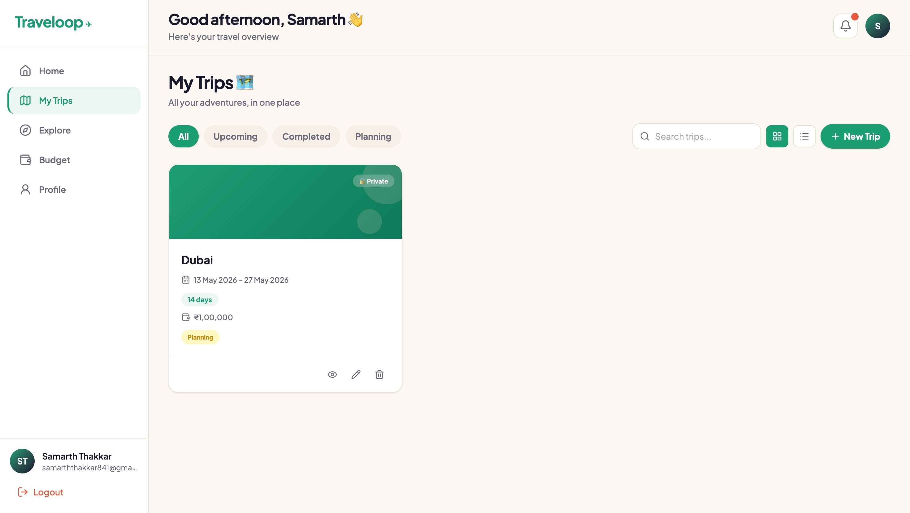
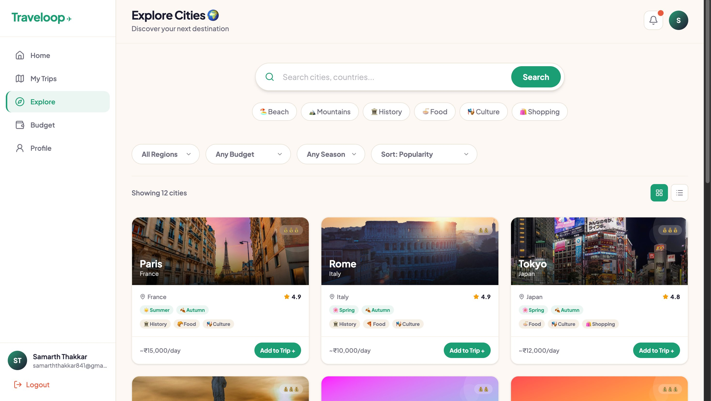
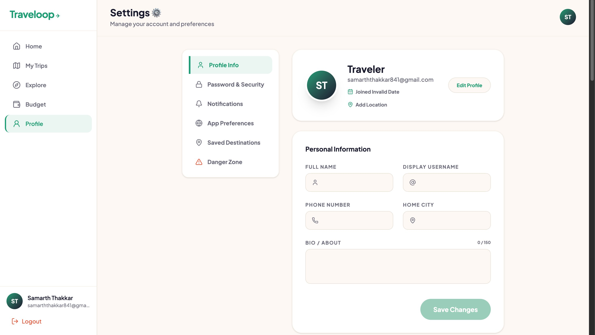
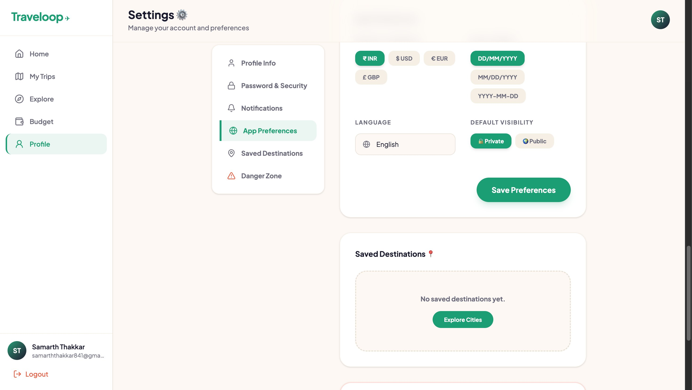
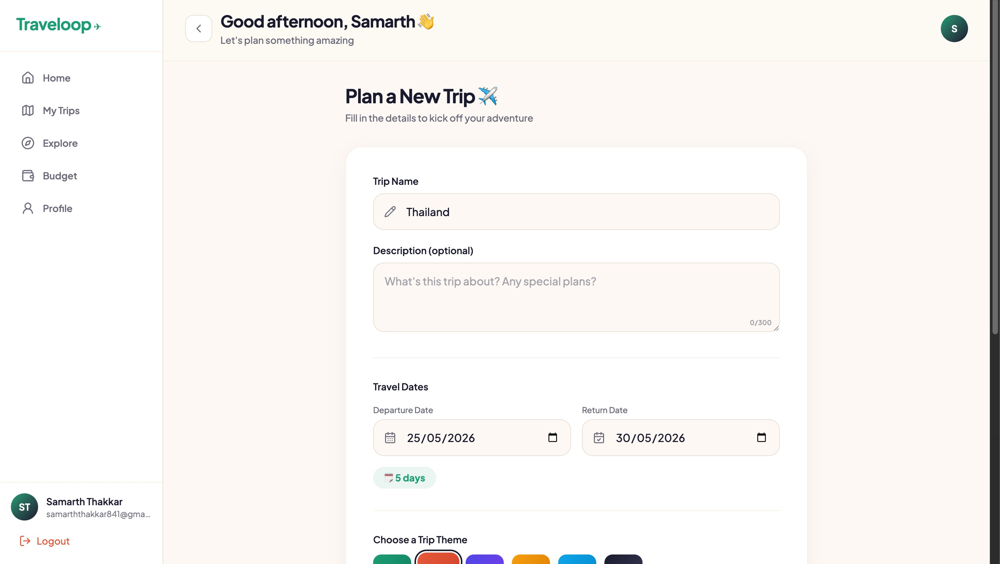
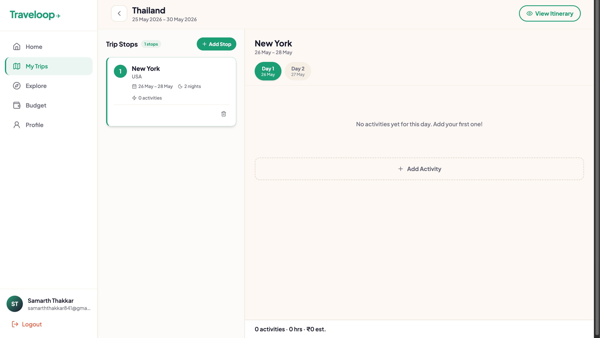
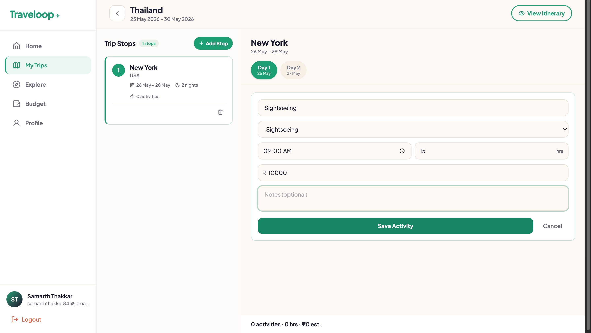
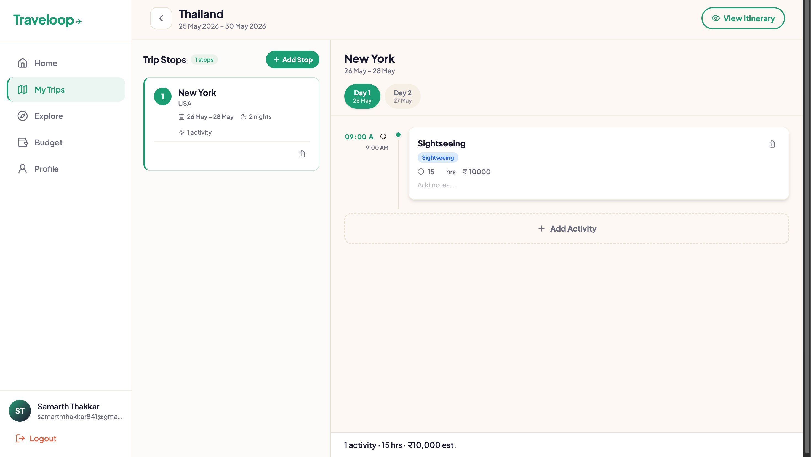

# ✈️ Traveloop — Personalized Travel Planning Made Easy

> **Plan smarter. Travel better.**
> A full-stack travel planning platform built for the Odoo Hackathon — helping travelers dream, design, and organize multi-city trips with ease.

---

## 📌 Table of Contents

- [Overview](#-overview)
- [Features](#-features)
- [Screenshots](#-screenshots)
- [Tech Stack](#-tech-stack)
- [Database Schema](#-database-schema)
- [Getting Started](#-getting-started)
- [Environment Variables](#-environment-variables)
- [Project Structure](#-project-structure)
- [Team](#-team)

---

## 🌍 Overview

**Traveloop** is a personalized, intelligent, and collaborative travel planning platform that transforms the way individuals plan and experience travel. It empowers users to dream, design, and organize trips with ease by offering an end-to-end travel planning tool that combines flexibility and interactivity.

Users can explore global destinations, visualize their journeys through structured itineraries, make cost-effective decisions, and share their travel plans within a community — making travel planning as exciting as the trip itself.

---

## ✨ Features

| # | Screen | Description |
|---|--------|-------------|
| 1 | 🔐 Login / Signup | Email + password auth, Google OAuth, forgot password |
| 2 | 🏠 Dashboard | Stats overview, upcoming trips, recommended destinations |
| 3 | ➕ Create Trip | Trip name, dates, theme, visibility, budget setup |
| 4 | 🗺️ My Trips | Grid/list view, filter by status, search, edit/delete |
| 5 | 🏗️ Itinerary Builder | Add stops, day-wise activity planning, auto-save |
| 6 | 👁️ Itinerary View | Timeline, Calendar & List views with budget summary |
| 7 | 🌆 City Search | Explore cities by region, budget, season with drawer |
| 8 | 🎯 Activity Search | Browse activities by category, cost, duration |
| 9 | 💰 Budget Tracker | Cost breakdown charts, per-day table, alerts |
| 10 | 🧳 Packing Checklist | AI-powered suggestions, categories, progress tracking |
| 11 | 🔗 Public Share | Shareable read-only itinerary, copy trip feature |
| 12 | 👤 Profile / Settings | Profile info, security, preferences, saved destinations |
| 13 | 📓 Trip Notes | Journal per trip/stop/day, AI summarize feature |
| 14 | 📊 Admin Dashboard | User stats, trip analytics, city/activity management |

---

## 📸 Screenshots

### 🏠 Dashboard — Home Screen
Get a bird's-eye view of your travel activity with live stats, upcoming trip cards, and quick actions.

![Dashboard] (./screenshots/01-dashboard.png)

---

### 🗺️ My Trips — Trip List
All your adventures in one place. Filter by status, search by name, and switch between grid and list views.



---

### 🌆 Explore Cities
Discover your next destination. Search cities, filter by region, budget level and season — with real images and cost-per-day info.



---

### 👤 Profile — Personal Information
Manage your account details, upload a profile photo, and control your travel identity.



---

### 🔒 Profile — Password & Security
Change your password with a live strength meter and manage all active sessions across devices.


---

### ⚙️ Profile — App Preferences
Set your preferred currency, date format, language, and default trip visibility.



---

### ➕ Create Trip
Start planning with a trip name, travel dates (with auto-calculated duration), a visual theme picker, visibility toggle, and budget estimate.



---

### 🏗️ Itinerary Builder — Empty State
Two-panel layout: manage stops on the left, build day-wise activities on the right. Clean empty state guides users to start.



---

### 🏗️ Itinerary Builder — Add Activity Form
Quickly add activities with name, category, time, duration, cost, and optional notes — all inline without leaving the page.



---

### 🏗️ Itinerary Builder — Activity Added
Activities appear in a clean timeline with category badges, duration, cost, and a live summary bar at the bottom.



---

### 👁️ Itinerary View — Timeline Mode
Review the full trip in a structured timeline — stop headers, day groups, activity cards with time/cost, and a budget usage bar.


---

## 🛠️ Tech Stack

| Layer | Technology |
|-------|-----------|
| **Frontend** | React 19 + Vite 8 |
| **Styling** | Tailwind CSS v4 |
| **Routing** | React Router DOM v7 |
| **Backend / Database** | Supabase (PostgreSQL) |
| **Auth** | Supabase Auth (Email + Google OAuth) |
| **Storage** | Supabase Storage (avatars, covers) |
| **Charts** | Recharts |
| **Icons** | Lucide React |
| **AI Features** | Anthropic Claude API |
| **Package Manager** | npm |

---

## 🗄️ Database Schema

```
users (via Supabase Auth)
  └── profiles         — full_name, username, avatar_url, preferences (jsonb)

trips
  ├── stops            — city, arrival/departure dates, order_index
  │   └── activities   — name, category, time, duration, cost, notes
  ├── checklist_items  — category, name, is_packed, order_index
  └── trip_notes       — title, content, note_type, linked_stop, reminder_date

cities                 — name, country, region, budget_level, avg_cost, popular_for
activities_master      — name, category, city, duration, cost, rating, tips
app_settings           — platform config (admin only)
```

---

## 🚀 Getting Started

### Prerequisites
- Node.js v18+
- npm v9+
- A Supabase project (free tier works)

### Installation

```bash
# 1. Clone the repository
git clone https://github.com/your-team/traveloop.git
cd traveloop/frontend

# 2. Install dependencies
npm install

# 3. Set up environment variables
cp .env.example .env
# Fill in your Supabase credentials (see below)

# 4. Start the development server
npm run dev
```

The app will be available at `http://localhost:5173`

### Build for Production

```bash
npm run build
npm run preview
```

---

## 🔑 Environment Variables

Create a `.env` file in the `frontend/` directory:

```env
VITE_SUPABASE_URL=https://your-project-id.supabase.co
VITE_SUPABASE_ANON_KEY=your-anon-key-here
VITE_ANTHROPIC_API_KEY=your-anthropic-api-key-here
```

> ⚠️ Never commit your `.env` file. It is already in `.gitignore`.

---

## 📁 Project Structure

```
frontend/
├── public/
├── src/
│   ├── lib/
│   │   └── supabaseClient.js       # Supabase client init
│   ├── components/
│   │   ├── Sidebar.jsx             # Main navigation sidebar
│   │   ├── TripCard.jsx            # Reusable trip card
│   │   ├── Toast.jsx               # Toast notifications
│   │   ├── DeleteModal.jsx         # Confirm delete modal
│   │   ├── ActivityCard.jsx        # Activity display card
│   │   ├── StopCard.jsx            # Stop list card
│   │   ├── CityCard.jsx            # City explore card
│   │   ├── CityDrawer.jsx          # City detail slide drawer
│   │   ├── ToggleSwitch.jsx        # Reusable toggle
│   │   ├── PasswordStrengthMeter.jsx
│   │   └── admin/
│   │       ├── AdminSidebar.jsx
│   │       ├── AdminTable.jsx
│   │       └── StatCard.jsx
│   ├── pages/
│   │   ├── Auth.jsx                # Login / Signup
│   │   ├── Dashboard.jsx           # Home screen
│   │   ├── CreateTrip.jsx          # New trip form
│   │   ├── MyTrips.jsx             # Trip list
│   │   ├── ItineraryBuilder.jsx    # Build itinerary
│   │   ├── ItineraryView.jsx       # View itinerary
│   │   ├── Explore.jsx             # City search
│   │   ├── Activities.jsx          # Activity search
│   │   ├── Budget.jsx              # Budget tracker
│   │   ├── PackingChecklist.jsx    # Packing list
│   │   ├── SharedItinerary.jsx     # Public share page
│   │   ├── Profile.jsx             # Settings & profile
│   │   ├── TripNotes.jsx           # Notes & journal
│   │   └── Admin.jsx               # Admin dashboard
│   ├── App.jsx                     # Routes definition
│   └── main.jsx
├── index.html
├── vite.config.js
├── tailwind.config.js
└── package.json
```

---

## 🛤️ App Routes

| Route | Page |
|-------|------|
| `/` | Login / Signup |
| `/dashboard` | Home Dashboard |
| `/create-trip` | Create New Trip |
| `/trips` | My Trips List |
| `/trips/:id/itinerary` | Itinerary Builder |
| `/trips/:id/view` | Itinerary View |
| `/trips/:id/budget` | Budget Tracker |
| `/trips/:id/checklist` | Packing Checklist |
| `/trips/:id/notes` | Trip Notes |
| `/explore` | Explore Cities |
| `/activities` | Browse Activities |
| `/share/:id` | Public Itinerary |
| `/profile` | Profile & Settings |
| `/admin` | Admin Dashboard |

---

## 🎨 Design System

```css
--font-sans: 'Plus Jakarta Sans', sans-serif;
--color-brand-primary: #1D9E75;
--color-brand-secondary: #E8593C;
--color-brand-dark: #1A1A2E;
--color-surface-bg: #FDF8F3;
--color-surface-card: #FFFFFF;
--color-surface-muted: #F5EFE6;
--color-text-primary: #1A1A2E;
--color-text-secondary: #6B6B7B;
--color-border: #E8E0D5;
```

---

## 🤖 AI Features

Traveloop integrates the **Anthropic Claude API** for two intelligent features:

- **🧳 AI Packing Suggestions** — Analyzes your trip destinations and duration to suggest a comprehensive, categorized packing list automatically.
- **📓 AI Trip Journal** — Reads all your trip notes and generates a beautifully written travel journal entry in first person.

---

## 👥 Team

Built with ❤️ for the **Odoo Hackathon**

| Role | Responsibility |
|------|---------------|
| Full Stack Dev | React frontend, Supabase integration |
| UI/UX Designer | Design system, component design |
| Backend Dev | Database schema, RLS policies |
| Product | Feature scope, user flows |

---

## 📄 License

This project was built for hackathon purposes. All rights reserved by the Traveloop team.

---

<p align="center">
  Made with ✈️ by the Traveloop Team &nbsp;|&nbsp; Odoo Hackathon 2025
</p>